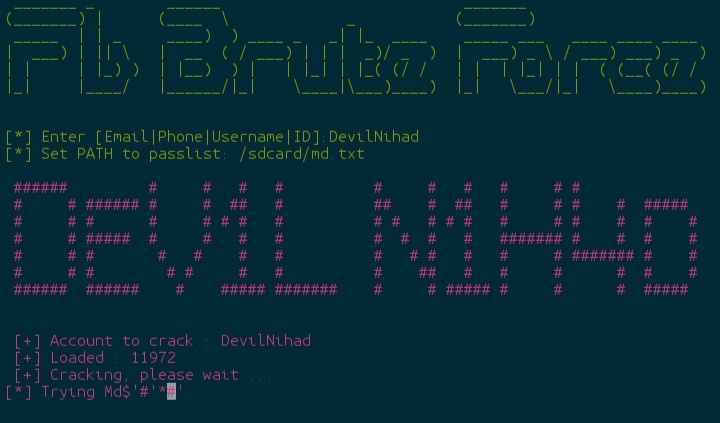

```How to install it```:

* `apt update`
* `apt upgrade`
* `apt install python2`
* `apt install python`
* `apt install git`
* `git clone https://github.com/DeV1LN1H4d/BruteForce`
* `cd BruteForce`
* `python2 BruteForce.py`
